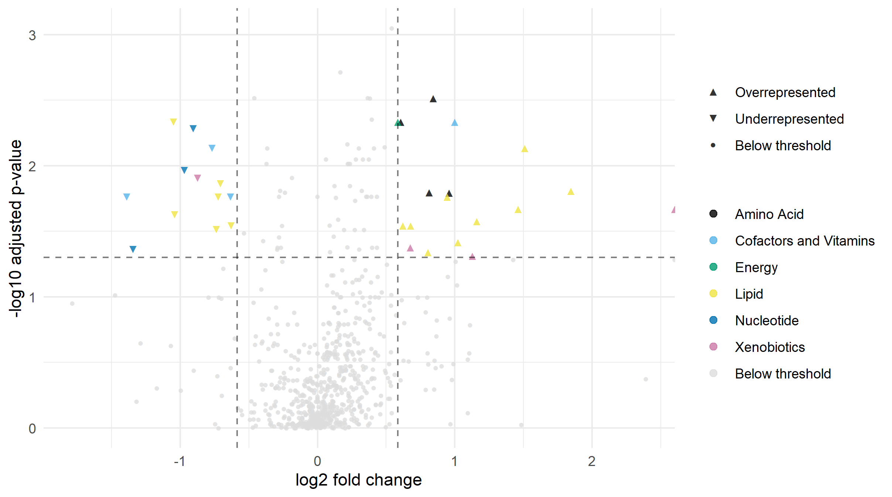
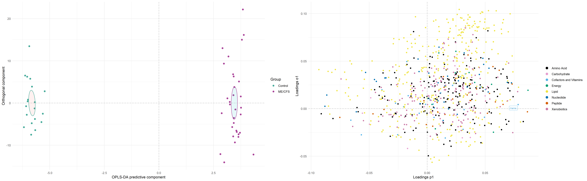

# metabolomics 
(Updated) Scripts and pipelines used to analyse metabolomics in my master thesis in biology. Using a different metabolomics datasets found in Germain A, Barupal DK, Levine SM, Hanson MR. Comprehensive Circulatory Metabolomics in ME/CFS Reveals Disrupted Metabolism of Acyl Lipids and Steroids. Metabolites. 2020 Jan 14;10(1):34. doi: 10.3390/metabo10010034. PMID: 31947545; PMCID: PMC7023305 and  Germain A, Ruppert D, Levine SM, Hanson MR. Prospective Biomarkers from Plasma Metabolomics of Myalgic Encephalomyelitis/Chronic Fatigue Syndrome Implicate Redox Imbalance in Disease Symptomatology. Metabolites. 2018 Dec 6;8(4):90. doi: 10.3390/metabo8040090. PMID: 30563204; PMCID: PMC6315598.

## Scripts
**tidying** Tidying the sample dataset for analysis 
**univariate** Univariate tests of difference between groups, and script for creating half violin/half boxplots with statistic's from rstatix output, and volcano plots. Ex:  
 
 
**multivariate** PCA, OPLS-DA, visualization (score-, loading-, s- and permutation plots) and tables of results 
 
**count_carbons_doublebonds** Count carbons and double bonds in lipids with naming conventions "class xx:y", "class(xx:y), "class(xx:y\xx:y)" (such as datasets supplied by Zora Bioscience or Biocrates), create heatmap with carbons on y axis and double bonds on x-axis, colored by log2 of fold change between groups  
 
